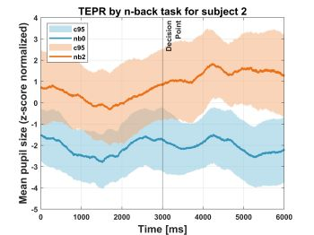
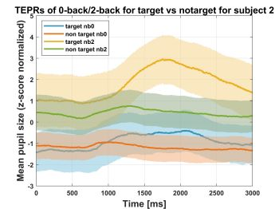

# decision-making-autonomous-driving
Decision Making in Autonomous Driving using Eye Tracker

The code was created as part of a Practical Project at the Applied Neurocognitive Psychology Lab/University of Oldenburg in 2020 - 2021 under the supervision of Rimo Aron Arndt, Dr. Anirudh Unni.
This code provides visualization of eye tracking data in the form of task evoked pupillary response called TEPRs during decision making and n-back tasks with two levels -0-back and 2-back in autonomous driving condition.

Steps:

Firstly Preprocessing of data was performed.

1. **Interpolation** To attenuate artifacts like eyeblinks a linear interpolation algorithm was applied.
2. **Aligning Timestamps**
3. **Normalization** Eyetracking data for each subject was normalized using z-score normalization.
4. **Epochs** Epochs were taken around decision making and n-back tasks.
5. **Visualization** TEPRs for both decsion making and n-back tasks are visualized. 

# Output

The matlab code outputs TEPR (Task Evoked Pupillary Response):

